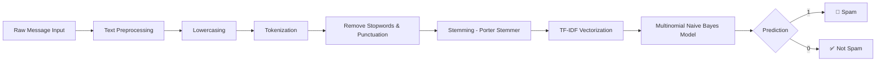

<div align="center">

# 📩 SMS / Email Spam Classifier

### An end-to-end Machine Learning application that detects spam messages in real time using NLP and Naive Bayes — deployed as an interactive Streamlit web app.

[](https://www.python.org/)
[](https://streamlit.io/)
[](https://scikit-learn.org/)
[](https://www.nltk.org/)
[](LICENSE)

[🚀 Live Demo](#-live-demo) · [📖 Overview](#-overview) · [🧠 How It Works](#-how-it-works) · [⚙️ Installation](#️-installation--setup) · [📁 Project Structure](#-project-structure)

</div>

---

## 📖 Overview

**Spam Classifier** is a supervised machine learning project that classifies SMS and email messages as **Spam** or **Not Spam (Ham)**. It combines classic **Natural Language Processing (NLP)** preprocessing with a **TF-IDF + Multinomial Naive Bayes** pipeline, wrapped in a clean, interactive **Streamlit** web interface.

This project demonstrates the full ML lifecycle — from raw text data to a deployed, production-ready application:

> **Data → Preprocessing → Feature Extraction → Model Training → Serialization → Deployment**

---

## ✨ Features

- 🔎 **Real-time spam detection** — paste any SMS/email text and get an instant prediction
- 🧹 **Robust NLP preprocessing pipeline** — lowercasing, tokenization, stopword removal, punctuation filtering, and stemming
- 📊 **TF-IDF vectorization** for converting raw text into meaningful numerical features
- 🤖 **Multinomial Naive Bayes** classifier — a fast, high-accuracy algorithm well-suited for text classification
- 💾 **Model persistence** using `pickle` for instant inference without retraining
- 🎨 **Clean, responsive UI** built with Streamlit — no frontend framework required
- ☁️ **Cloud-deployable** — ready to ship on Render, Streamlit Community Cloud, or any Python-hosting platform

---

## 🧠 How It Works



**Preprocessing pipeline:**

1. Convert text to lowercase
2. Tokenize into individual words using `nltk.word_tokenize`
3. Remove non-alphanumeric tokens
4. Filter out English stopwords and punctuation
5. Apply **Porter Stemming** to reduce words to their root form
6. Transform cleaned text into TF-IDF feature vectors
7. Feed vectors into the trained **Multinomial Naive Bayes** model for classification

---

## 🛠️ Tech Stack

| Category | Tools & Libraries |
|---|---|
| **Language** | Python |
| **ML Framework** | scikit-learn (TF-IDF Vectorizer, Multinomial Naive Bayes) |
| **NLP** | NLTK (tokenization, stopwords, Porter Stemmer) |
| **Web App / UI** | Streamlit |
| **Model Serialization** | Pickle |
| **Data Handling** | NumPy, Pandas |
| **Visualization (EDA)** | Matplotlib, Seaborn |
| **Deployment** | Render / Streamlit Community Cloud |
| **Version Control** | Git & GitHub |

---

## 📁 Project Structure

```
Spam-Classifier/
│
├── app.py                 # Streamlit application (UI + inference logic)
├── model.pkl               # Trained Multinomial Naive Bayes model
├── vectorizer.pkl           # Fitted TF-IDF vectorizer
├── requirements.txt         # Python dependencies
├── LICENSE                  # MIT License
└── README.md                # Project documentation
```

---

## ⚙️ Installation & Setup

### 1. Clone the repository
```bash
git clone https://github.com/Rohitranelab/Spam-Classifier.git
cd Spam-Classifier
```

### 2. Create and activate a virtual environment
```bash
python -m venv venv

# Windows
venv\Scripts\activate

# macOS/Linux
source venv/bin/activate
```

### 3. Install dependencies
```bash
pip install -r requirements.txt
```

### 4. Download required NLTK data
```python
import nltk
nltk.download('punkt')
nltk.download('punkt_tab')
nltk.download('stopwords')
```

### 5. Run the app
```bash
streamlit run app.py
```

The app will open automatically at `http://localhost:8501`.

---

## 🚀 Live Demo

```text
https://spam-classifier-l63t.onrender.com
```

---

## 📈 Model Performance

| Metric | Score |
|---|---|
| Accuracy | 0.96 |
| Precision | 1.0 |

> The model was evaluated using standard train/test split with **accuracy** and **precision** as key metrics, prioritizing precision to minimize false positives (legitimate messages incorrectly flagged as spam).

---

## 🌱 Future Improvements

- [ ] Add confidence score / prediction probability display
- [ ] Support batch prediction via CSV upload
- [ ] Experiment with deep learning models (LSTM / BERT) for comparison
- [ ] Add unit tests and CI/CD pipeline
- [ ] Dockerize the application for consistent deployment

---

## 📜 License

This project is licensed under the **MIT License** — see the [LICENSE](LICENSE) file for details.

---

## 👨‍💻 Author

### Rohit Rane

Aspiring Machine Learning Engineer | MLOps Enthusiast

- Machine Learning
- MLOps
- FastAPI
- MongoDB
- Python

[](https://github.com/Rohitranelab)

---

<div align="center">

⭐ **If you found this project useful, consider giving it a star!** ⭐

</div>
